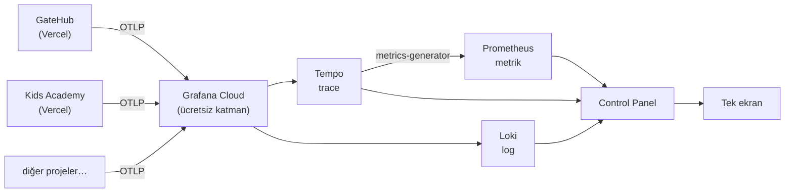

# Control Panel

Birden fazla Vercel projesinin metrik, log ve trace verisini tek bir ekrandan
izleyen, kendi SSO altyapıma bağlı bir gözlemlenebilirlik paneli.

Grafana Cloud'un ücretsiz katmanını bir **veri motoru** olarak kullanır: veriler
orada durur, sorgular sunucu tarafında atılır, arayüz tamamen bu uygulamaya
aittir. Kimsenin Grafana hesabı açmasına veya Grafana arayüzüne girmesine gerek
yoktur.

## Çözdüğü problem

Portföyümdeki projeler (GateHub, Kids Academy, ReceiptFlow, TestMetrix,
CarRenting) ayrı ayrı Vercel'de çalışıyor. Bir tanesinde hata oranı yükseldiğinde
ya da sayfa yavaşladığında bunu fark etmenin tek yolu siteyi elle açıp bakmaktı.
Her proje için ayrı bir izleme kurmak da, hepsi için Grafana arayüzünde
gezinmek de pratik değildi.

Control Panel bu ihtiyacı karşılıyor: **tüm projeler tek listede**, aynı
metriklerle, aynı dille.

## Mimari



Projeler Vercel'de **serverless** çalıştığı için Prometheus'un klasik "pull"
(scrape) modeli kullanılamaz — kazınacak kalıcı bir süreç yoktur. Bu yüzden
mimari **push tabanlıdır**: her uygulama OpenTelemetry ile telemetrisini OTLP
üzerinden gönderir.

Uygulamalar yalnızca **trace** gönderir. RED metrikleri (istek oranı, hata
oranı, gecikme) Grafana Cloud tarafında Tempo'nun metrics-generator'ı tarafından
bu trace'lerden türetilir. Yani ayrıca metrik toplamaya gerek kalmaz — tek bir
enstrümantasyon üç veri tipini birden besler.

## Özellikler

**Genel bakış** — Her servis için RED metrikleri, sparkline'lı kartlar ve
tazelik rozeti. Rozet "aktif" ile "son veri 4 saat önce" arasını ayırır:
ziyaretçisi olmayan bir serverless uygulama meşru olarak hiçbir şey göndermez,
o yüzden sessizlik tek başına "çöktü" diye okunamaz.

**Servis detayı** — p50/p95/p99 gecikme, rota bazında kırılımlar ve iki
teşhis aracı:

- **Trace listesi + span waterfall** — Süreye veya hata durumuna göre filtrele,
  bir isteğe tıkla, uçtan uca dökümünü gör: hangi adım ne kadar sürdü, nerede
  takıldı. Grafikteki bir sıçramayı somut bir isteğe kadar takip edebilirsin.
- **Canlı log akışı** — Seviye filtresi ve metin araması. Log satırları aktif
  trace kimliğini taşır, böylece log ile istek arasındaki bağ korunur.

**Özelleştirilebilir panolar** — Grafik ekle: servis, metrik, grafik türü
(çizgi/alan/çubuk), renk ve zaman aralığı seç. Hazır metrikler yetmezse doğrudan
PromQL yaz; o servisin yayınladığı metrik adları tıklanabilir liste olarak
sunulur. Düzenler tarayıcıda saklanır, dosyaya aktarılıp başka makineye
taşınabilir.

**Uyarılar** — Hata oranı, gecikme ve sessizlik eşikleri sunucu tarafında
değerlendirilir; sol menüde aktif uyarı rozeti belirir. Hata oranı yalnızca
anlamlı trafik varken değerlendirilir — tek istekteki tek hata %100 görünür ama
uyarı üretmez.

**Metrik kataloğu** — Her servisin yayınladığı ham metrik adları ve hangi
panellerin desteklendiği. "Hangi veriye sahibiz?" sorusunun cevabı.

## Dikkat çeken tasarım kararları

**Metrik adları tahmin edilmez, keşfedilir.** Tempo, gecikme histogramını
sürümüne ve histogram moduna göre farklı adlarla yayınlıyor
(`traces_spanmetrics_latency_bucket`, `..._duration_seconds_bucket`, ya da
`_bucket` eki olmayan native histogram). Adı sabit yazmak, sorgu tutmadığında
boş sonuç döndürüp arayüzde sessizce "0" göstermeye yol açıyordu — yani hata
vermeden yanlış bilgi. `lib/metrics-schema.ts` artık Prometheus'a hangi
metriklerin var olduğunu sorup uygun sorguyu kuruyor; gerçekten veri yoksa
"yayınlanmıyor" diyor.

**Servisler de keşfedilir.** Yeni bir proje bağlamak için bu repoda kod
değişikliği gerekmez. Uygulama telemetri göndermeye başladığı an sol menüde
belirir.

**Kimlik doğrulama kendi SSO'ma bağlı.** Panel, [GateHub](https://github.com/ahmetkurtbm/gatehub)'a
kayıtlı bir OAuth istemcisidir (OIDC authorization code + PKCE). GateHub hesabı
olmak yetmez; yalnızca izin listesindeki adresler girebilir. Kendi kimlik
altyapımı gerçek bir işte kullanmış oluyorum.

**Kimlik bilgileri tarayıcıya hiç ulaşmaz.** Grafana sorguları yalnızca sunucu
tarafında, salt-okunur bir erişim token'ı ile atılır; istemci bileşenleri
uygulamanın kendi korumalı API rotalarından veri çeker.

## Teknoloji

Next.js 16 (App Router) · TypeScript · Tailwind CSS · Recharts · NextAuth v5 ·
OpenTelemetry · Grafana Cloud (Prometheus/Mimir, Loki, Tempo)

## Ekran yapısı

| Sayfa | İçerik |
|---|---|
| `/` | Tüm servislerin RED kartları + pano |
| `/services/[service]` | Servis detayı, trace waterfall, loglar |
| `/alerts` | Aktif uyarılar ve eşikler |
| `/metrics` | Metrik kataloğu |

---

## Kurulum

<details>
<summary>Kendi ortamında çalıştırmak için</summary>

**1. GateHub'da OAuth istemcisi kaydet** (`/dashboard` → "Yeni uygulama"),
redirect URI: `http://localhost:3000/api/auth/callback/gatehub`.

**2. Ortam değişkenleri** — `.env.example` dosyasını `.env.local` olarak
kopyala:

- `GATEHUB_CLIENT_ID` / `GATEHUB_CLIENT_SECRET` — 1. adımdan
- `AUTH_SECRET` — `openssl rand -base64 32`
- `ADMIN_EMAILS` — panele girebilecek adresler (boşsa kimse giremez)
- `GRAFANA_*_URL` / `GRAFANA_*_USER` — Grafana Cloud → Connections → Data
  sources altında her datasource'un (Prometheus, Loki, Tempo) sayfasındaki
  URL ve "User" alanları
- `GRAFANA_API_TOKEN` — grafana.com → Access Policies → `metrics:read`,
  `logs:read`, `traces:read` kapsamlı bir policy altında üretilmiş token
  (üç datasource için de Basic Auth parolası olarak bu kullanılır)

**3. Çalıştır** — `npm run dev`, ardından `http://localhost:3000`.

</details>

<details>
<summary>Yeni bir projeyi bağlamak</summary>

Bu repoda değişiklik gerekmez. Bağlanacak projede:

```bash
npm i @vercel/otel
```

Proje köküne `instrumentation.ts`:

```ts
import { registerOTel } from "@vercel/otel";

export function register() {
  registerOTel({ serviceName: process.env.OTEL_SERVICE_NAME ?? "proje-adi" });
}
```

Vercel → Settings → Environment Variables:

```
OTEL_SERVICE_NAME=proje-adi
OTEL_EXPORTER_OTLP_ENDPOINT=<Grafana Cloud OTLP endpoint>
OTEL_EXPORTER_OTLP_HEADERS=<Authorization=Basic ...>
```

Endpoint ve header tüm projelerde aynıdır. Deploy et, birkaç istek at; servis
sol menüde kendiliğinden belirir.

</details>

<details>
<summary>Log göndermeyi açmak</summary>

`@vercel/otel` yalnızca trace gönderir. Vercel'in Log Drain özelliği ücretli
plan gerektirdiği için loglar uygulamadan **OpenTelemetry Logs SDK** ile aynı
OTLP adresine gönderilir.

Örnek: GateHub'daki `instrumentation.ts` (LoggerProvider kaydı) ve
`lib/otel-logs.ts` (`log.info` / `log.error` sarmalayıcısı). Yeni bir projede
açmak için bu iki dosyayı kopyalayıp şunu çalıştırmak yeterli — ek ortam
değişkeni gerekmez:

```bash
npm i @opentelemetry/exporter-logs-otlp-http
```

</details>
